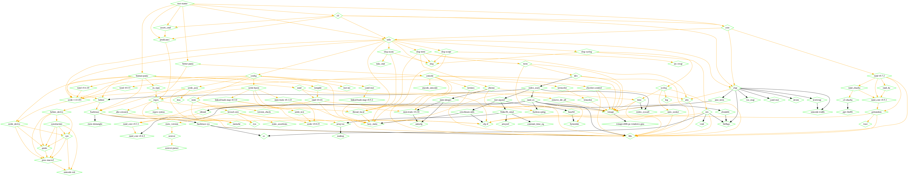

 

<h1 align="center">rust-starter</h1>

 <strong>
    A simple framework to build Rust CLI Applications
 </strong>

 

  

[Documentation]() | [Website](https://rust-starter.github.io) | [Tutorial]()

`rust-starter` aims to provide high quality components to bootstrap your Rust CLI Project. It includes a battery of most used libraries; and defines a set of Rust best practices.

<!-- START doctoc generated TOC please keep comment here to allow auto update -->
<!-- DON'T EDIT THIS SECTION, INSTEAD RE-RUN doctoc TO UPDATE -->
**Table of Contents**

- [What's New?](#whats-new)
- [About](#about)
- [FAQ](#faq)
- [Features](#features)
- [Quick Bootstrapping](#quick-bootstrapping)
- [Included Libraries](#included-libraries)
- [How to Contribute](#how-to-contribute)
  - [Versioning](#versioning)
- [License](#license)

<!-- END doctoc generated TOC please keep comment here to allow auto update -->

## What's New?

## About

`rust-starter` is an empty Rust CLI application with libraries, and few defaults. The goal is to help you bootstrap your next CLI project as quickly as possible while ensuring you make use of the best tools and best-practices that are available today.

There is no configuration required (though we recommend you check all the possible configurations possible). A blank slate will compile, and has a few commands. You can start coding right away!

## FAQ

For the Full FAQ, check the [website](https://rust-starter.github.io/#faq)

## Features

non-exhaustive, still under writing

- Clap for Command Line Argument parsing.
- Error Chaining with Failure.
- Configuration management with config-rs.
- Logging.
- CI/CD and a Dockerfile to run your CLI inside a Docker container.
- Code Coverage, Justfile, etc..
- MIT License.

## Quick Bootstrapping

`rust-starter` should compile as is. A `cargo-generate` template is also [available](https://github.com/rust-starter/rust-starter-generate). For a more detailed introduction, check the [Getting Started](https://rust-starter.github.io/#getting-started) guide.

## Included Libraries

`rust-starter` uses a bunch of open source libraries. These are actual dependencies.

## How to Contribute

Details on how to contribute can be found in the [CONTRIBUTING.md](.github/CONTRIBUTING.md) file.

### Versioning

Rust Starter stricltly adheres to the [SemVer](https://semver.org/) Semantic Versioning.

## License

`rust-starter` is licensed under the MIT license. Please read the [LICENSE](LICENSE) file in this repository for more information.
